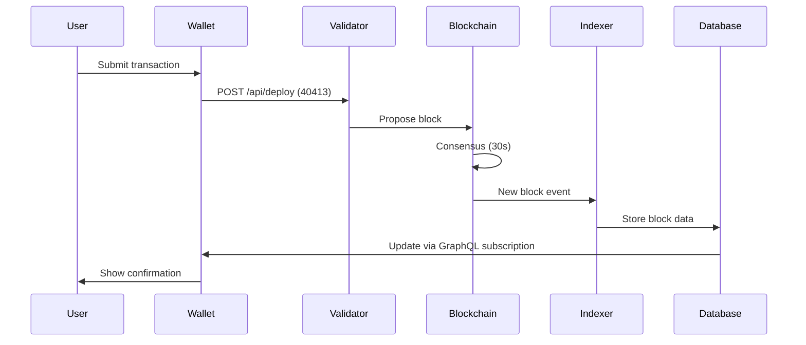
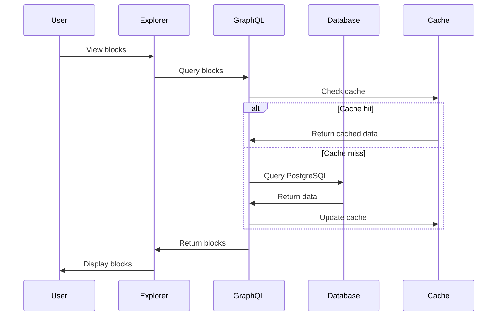
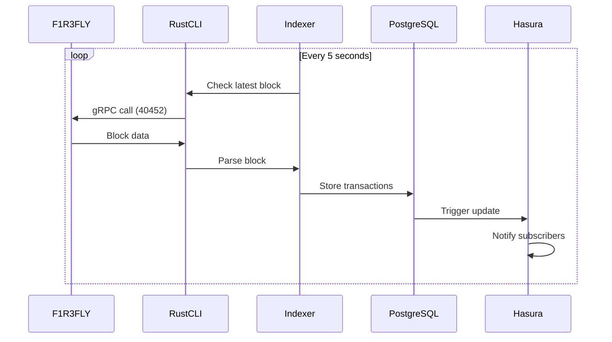

# System Architecture Deep Dive

## 🏗️ Architecture Overview

ASI Chain follows a microservices architecture with clear separation between blockchain core, data indexing, API layer, and frontend applications.

```
┌─────────────────────────────────────────────────────────────┐
│                     User Interface Layer                      │
├────────────┬──────────────┬─────────────┬──────────────────┤
│  Wallet    │   Explorer   │   Faucet    │  Documentation   │
│ (React 18) │  (React 19)  │ (Express)   │  (Docusaurus)    │
└────────────┴──────────────┴─────────────┴──────────────────┘
                              │
┌─────────────────────────────────────────────────────────────┐
│                         API Layer                            │
├─────────────────┬───────────────────┬──────────────────────┤
│  GraphQL API    │   REST API        │   WebSocket          │
│  (Hasura)       │   (Python)        │   Subscriptions      │
│  Port: 8080     │   Port: 9090      │   Port: 8080/ws      │
└─────────────────┴───────────────────┴──────────────────────┘
                              │
┌─────────────────────────────────────────────────────────────┐
│                      Data Layer                              │
├─────────────────┬───────────────────┬──────────────────────┤
│  PostgreSQL     │   Redis Cache     │   Python Indexer     │
│  Port: 5432     │   Ports: 6379/80  │   (Async Service)    │
└─────────────────┴───────────────────┴──────────────────────┘
                              │
┌─────────────────────────────────────────────────────────────┐
│                   Blockchain Bridge                          │
├──────────────────────────────────────────────────────────────┤
│                    Rust CLI (node_cli)                       │
│              All blockchain operations via CLI               │
└──────────────────────────────────────────────────────────────┘
                              │
┌─────────────────────────────────────────────────────────────┐
│                    Blockchain Layer                          │
├─────────────┬────────────┬────────────┬────────────────────┤
│  Bootstrap  │ Validator1 │ Validator2 │  Observer/ReadOnly │
│  Port:40403 │ Port:40413 │ Port:40423 │  Port:40453       │
└─────────────┴────────────┴────────────┴────────────────────┘
```

## 🔄 Data Flow Patterns

### 1. Transaction Flow



### 2. Query Flow



### 3. Indexing Flow



## 🎯 Key Architectural Decisions

### 1. Rust CLI Bridge Pattern

**Decision**: All blockchain interactions go through `node_cli` binary

**Rationale**:
- F1R3FLY's HTTP API is limited and unstable
- gRPC provides better performance and reliability
- Rust CLI handles complex serialization/deserialization
- Maintains compatibility with F1R3FLY updates

**Implementation**:
```python
# indexer/src/rust_indexer.py
async def get_block(self, block_number: int):
    cmd = [
        self.node_cli_path,
        "show-block",
        "--host", self.node_host,
        "--port", str(self.grpc_port),
        "--block-hash", block_hash
    ]
    result = await self._run_command(cmd)
    return self._parse_block_output(result)
```

### 2. Observer Node Pattern

**Decision**: Separate read-only node for queries

**Rationale**:
- Validators focus on consensus and block production
- Observer node optimized for data queries
- Reduces load on validator nodes
- Better query performance

**Configuration**:
```yaml
# Observer node (40452/40453)
- Read operations only
- No transaction processing
- Optimized for indexer queries
- Higher query cache settings
```

### 3. Global State Caching

**Decision**: 15-second cache for wallet balances

**Rationale**:
- Prevents API flooding from frequent balance checks
- Reduces database load
- Acceptable UX trade-off for performance
- Configurable per component

**Implementation**:
```typescript
// asi_wallet_v2/src/services/balanceCache.ts
class BalanceCache {
  private cache = new Map();
  private TTL = 15000; // 15 seconds
  
  get(address: string): Balance | null {
    const entry = this.cache.get(address);
    if (!entry) return null;
    if (Date.now() - entry.timestamp > this.TTL) {
      this.cache.delete(address);
      return null;
    }
    return entry.balance;
  }
}
```

### 4. Zero-Touch Deployment

**Decision**: Automated Hasura relationship configuration

**Rationale**:
- Reduces deployment complexity
- Eliminates manual configuration errors
- Ensures consistency across environments
- Speeds up development setup

**Implementation**:
```bash
# indexer/scripts/setup-hasura-relationships.sh
# Automatically creates all GraphQL relationships
# Runs on indexer startup
```

## 🔧 Component Architecture

### ASI Wallet v2

```
asi_wallet_v2/
├── src/
│   ├── components/        # React components
│   │   ├── Wallet/        # Core wallet UI
│   │   ├── WalletConnect/ # DApp connectivity
│   │   └── Hardware/      # Ledger/Trezor support
│   ├── services/          # Business logic
│   │   ├── RChainService.ts    # Blockchain interface
│   │   ├── CryptoService.ts    # Cryptography
│   │   └── StorageService.ts   # Encrypted storage
│   ├── store/            # Redux state management
│   │   ├── slices/       # Feature slices
│   │   └── middleware/   # Custom middleware
│   └── utils/            # Utility functions
```

**Key Features**:
- WalletConnect v2 integration
- Hardware wallet support (Ledger, Trezor)
- Biometric authentication (WebAuthn)
- Multi-signature wallets
- Rholang IDE integration

### Blockchain Explorer

```
explorer/
├── src/
│   ├── components/       # UI components
│   │   ├── BlockList/    # Block display
│   │   ├── ValidatorsList/ # Validator tracking
│   │   └── TransactionView/ # Transaction details
│   ├── graphql/          # GraphQL queries
│   │   ├── queries/      # Query definitions
│   │   ├── subscriptions/ # Real-time updates
│   │   └── generated/    # TypeScript types
│   ├── pages/           # Route pages
│   └── hooks/           # Custom React hooks
```

**Key Features**:
- Real-time block updates via WebSocket
- Validator deduplication (v1.0.2 fix)
- Transaction search and filtering
- Network statistics dashboard
- CSV export functionality

### Python Indexer

```
indexer/
├── src/
│   ├── rust_indexer.py   # Main indexing logic
│   ├── db/               # Database operations
│   │   ├── models.py     # SQLAlchemy models
│   │   └── queries.py    # Query builders
│   ├── api/              # REST API endpoints
│   │   ├── routes.py     # FastAPI routes
│   │   └── schemas.py    # Pydantic schemas
│   └── utils/            # Helper functions
├── migrations/           # Database migrations
└── scripts/             # Deployment scripts
```

**Architecture Highlights**:
- Async Python with asyncio
- Subprocess calls to Rust CLI
- PostgreSQL with connection pooling
- Automatic Hasura configuration
- Health check endpoints

### TypeScript Faucet

```
faucet/typescript-faucet/
├── src/
│   ├── server.ts         # Express server
│   ├── services/         # Business logic
│   │   ├── wallet.ts     # Wallet operations
│   │   └── database.ts   # SQLite storage
│   ├── middleware/       # Express middleware
│   │   ├── rateLimiter.ts # Rate limiting
│   │   └── validator.ts  # Input validation
│   └── routes/           # API routes
```

**Design Patterns**:
- Rate limiting per IP
- Transaction queue management
- Balance monitoring
- SQLite for persistence
- Cron jobs for maintenance

## 🔌 Integration Points

### 1. Wallet ↔ Indexer

```typescript
// Wallet queries indexer for balance
const getBalance = async (address: string) => {
  // First check cache
  const cached = balanceCache.get(address);
  if (cached) return cached;
  
  // Query indexer API
  const response = await fetch(`${INDEXER_URL}/balance/${address}`);
  const balance = await response.json();
  
  // Update cache
  balanceCache.set(address, balance);
  return balance;
};
```

### 2. Explorer ↔ GraphQL

```graphql
# Explorer subscription for new blocks
subscription NewBlocks {
  blocks(order_by: {block_number: desc}, limit: 1) {
    block_number
    timestamp
    validator
    deployments {
      deploy_id
      deployer
      cost
    }
  }
}
```

### 3. Indexer ↔ F1R3FLY

```python
# Indexer uses Rust CLI for blockchain access
async def sync_blocks(self):
    latest_indexed = await self.get_latest_indexed_block()
    latest_chain = await self.get_latest_chain_block()
    
    for block_num in range(latest_indexed + 1, latest_chain + 1):
        block_data = await self.get_block_via_cli(block_num)
        await self.process_block(block_data)
```

### 4. Faucet ↔ Validator

```typescript
// Faucet sends transactions directly to validator
const sendTokens = async (recipient: string, amount: number) => {
  const deploy = {
    term: generateTransferRholang(recipient, amount),
    phloLimit: 100000,
    phloPrice: 1,
    deployer: FAUCET_ADDRESS,
    sig: await signDeploy(deployData, PRIVATE_KEY)
  };
  
  // Send to validator, not bootstrap!
  return fetch('http://13.251.66.61:40413/api/deploy', {
    method: 'POST',
    body: JSON.stringify(deploy)
  });
};
```

## 🔐 Security Architecture

### Defense in Depth

```
Layer 1: Network Security
├── Firewall rules
├── DDoS protection
└── Rate limiting

Layer 2: Application Security
├── Input validation
├── SQL injection prevention
├── XSS protection
└── CSRF tokens

Layer 3: Data Security
├── Encryption at rest
├── Encryption in transit
├── Key management
└── Access control

Layer 4: Monitoring
├── Intrusion detection
├── Anomaly detection
├── Audit logging
└── Alert system
```

### Encryption Patterns

```typescript
// Wallet encryption (AES-256-GCM)
const encryptWallet = (data: WalletData, password: string) => {
  const salt = crypto.randomBytes(32);
  const key = pbkdf2(password, salt, 100000, 32, 'sha256');
  const iv = crypto.randomBytes(16);
  const cipher = crypto.createCipheriv('aes-256-gcm', key, iv);
  // ... encryption logic
};

// Hardware wallet integration
const signWithLedger = async (transaction: Transaction) => {
  const transport = await TransportWebUSB.create();
  const app = new AppEth(transport);
  const signature = await app.signTransaction(path, rawTx);
  return signature;
};
```

## 🚀 Performance Optimizations

### 1. Database Indexing

```sql
-- Critical indexes for performance
CREATE INDEX idx_blocks_number ON blocks(block_number DESC);
CREATE INDEX idx_deployments_block ON deployments(block_number);
CREATE INDEX idx_transactions_timestamp ON transactions(timestamp DESC);
CREATE INDEX idx_balances_address ON balance_snapshots(address, timestamp DESC);

-- Composite indexes for common queries
CREATE INDEX idx_validator_blocks ON blocks(validator, block_number DESC);
CREATE INDEX idx_deployer_deployments ON deployments(deployer, timestamp DESC);
```

### 2. Caching Strategy

```yaml
Cache Layers:
  L1 - Browser Cache:
    - Static assets: 1 year
    - API responses: 15 seconds
    
  L2 - Redis Cache:
    - Database queries: 60 seconds
    - Computed values: 5 minutes
    
  L3 - PostgreSQL Cache:
    - Query plan cache
    - Connection pooling
```

### 3. Query Optimization

```typescript
// Batch queries to reduce round trips
const batchQuery = gql`
  query GetBlocksAndValidators($limit: Int!) {
    blocks(limit: $limit, order_by: {block_number: desc}) {
      block_number
      timestamp
      validator
    }
    validators {
      address
      stake
      status
    }
  }
`;

// Use DataLoader for N+1 query prevention
const blockLoader = new DataLoader(async (ids) => {
  const blocks = await getBlocksByIds(ids);
  return ids.map(id => blocks.find(b => b.id === id));
});
```

## 🔄 Scaling Considerations

### Horizontal Scaling

```yaml
Scalable Components:
  - Wallet UI: CDN + multiple instances
  - Explorer: Load balanced instances
  - Indexer API: Multiple workers
  - GraphQL: Hasura clustering
  - Redis: Primary-replica setup

Non-Scalable (Currently):
  - PostgreSQL: Single primary
  - F1R3FLY nodes: Fixed validator set
  - Rust CLI: Single process per indexer
```

### Vertical Scaling

```yaml
Resource Requirements:
  Minimum (Development):
    - CPU: 2 cores
    - RAM: 4 GB
    - Storage: 20 GB
    
  Recommended (Production):
    - CPU: 8 cores
    - RAM: 16 GB
    - Storage: 100 GB SSD
    
  High Load:
    - CPU: 16+ cores
    - RAM: 32+ GB
    - Storage: 500 GB NVMe
```

## 🔍 Monitoring Architecture

### Metrics Collection

```yaml
Prometheus Metrics:
  - Node metrics: CPU, memory, disk
  - Application metrics: Request rate, latency
  - Business metrics: Transactions, active users
  - Custom metrics: Block time, sync lag

Grafana Dashboards:
  - System Overview
  - Blockchain Health
  - API Performance
  - Database Statistics
  - Alert Summary
```

### Log Aggregation

```yaml
Log Sources:
  - Application logs: JSON format
  - System logs: journald
  - Docker logs: json-file driver
  - Access logs: Combined format

Log Pipeline:
  Sources → Filebeat → Logstash → Elasticsearch → Kibana
```

## 📊 Database Schema

### Core Tables

```sql
-- Blocks table (heart of the system)
CREATE TABLE blocks (
    block_number BIGINT PRIMARY KEY,
    block_hash VARCHAR(64) UNIQUE NOT NULL,
    parent_hash VARCHAR(64),
    timestamp TIMESTAMP NOT NULL,
    validator VARCHAR(150),
    deployments_count INT DEFAULT 0,
    created_at TIMESTAMP DEFAULT CURRENT_TIMESTAMP
);

-- Deployments table
CREATE TABLE deployments (
    deploy_id VARCHAR(64) PRIMARY KEY,
    block_number BIGINT REFERENCES blocks(block_number),
    deployer VARCHAR(150) NOT NULL,
    term TEXT,
    phlo_limit BIGINT,
    phlo_price BIGINT,
    cost BIGINT,
    error_message TEXT,
    timestamp TIMESTAMP
);

-- Validator bonds table
CREATE TABLE validator_bonds (
    id SERIAL PRIMARY KEY,
    block_number BIGINT REFERENCES blocks(block_number),
    validator VARCHAR(150) NOT NULL,
    stake BIGINT NOT NULL,
    UNIQUE(block_number, validator)
);

-- Balance snapshots table
CREATE TABLE balance_snapshots (
    id SERIAL PRIMARY KEY,
    address VARCHAR(150) NOT NULL,
    balance BIGINT NOT NULL,
    block_number BIGINT REFERENCES blocks(block_number),
    timestamp TIMESTAMP NOT NULL,
    INDEX idx_address_time (address, timestamp DESC)
);
```

## 🎨 Frontend Architecture

### Component Hierarchy

```
App
├── Layout
│   ├── Header
│   │   ├── Navigation
│   │   └── WalletConnect
│   ├── Sidebar
│   └── Footer
├── Routes
│   ├── Dashboard
│   │   ├── BalanceCard
│   │   ├── TransactionList
│   │   └── QuickActions
│   ├── Send
│   │   ├── RecipientInput
│   │   ├── AmountInput
│   │   └── GasSettings
│   └── Settings
│       ├── Security
│       ├── Network
│       └── Advanced
└── Providers
    ├── ThemeProvider
    ├── WalletProvider
    └── GraphQLProvider
```

### State Management

```typescript
// Redux store structure
interface RootState {
  wallet: {
    address: string;
    balance: bigint;
    isConnected: boolean;
  };
  transactions: {
    pending: Transaction[];
    confirmed: Transaction[];
    failed: Transaction[];
  };
  ui: {
    theme: 'light' | 'dark';
    isLoading: boolean;
    notifications: Notification[];
  };
  cache: {
    blocks: Block[];
    validators: Validator[];
    lastUpdate: number;
  };
}
```

## 📚 Next Steps

After understanding the architecture:
1. Continue to [05-PRODUCTION-INFRASTRUCTURE.md](05-PRODUCTION-INFRASTRUCTURE.md)
2. Review component-specific guides
3. Study the codebase with this context
4. Identify areas for improvement

---

**Document Version**: 1.0  
**Last Updated**: September 2025  
**Next Review**: Quarterly